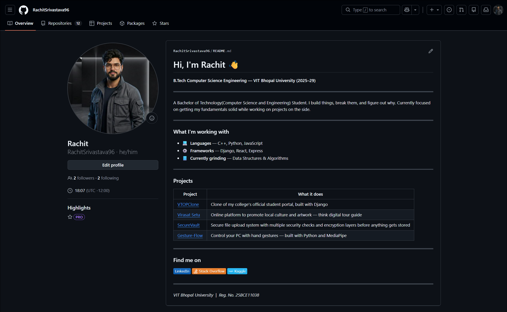
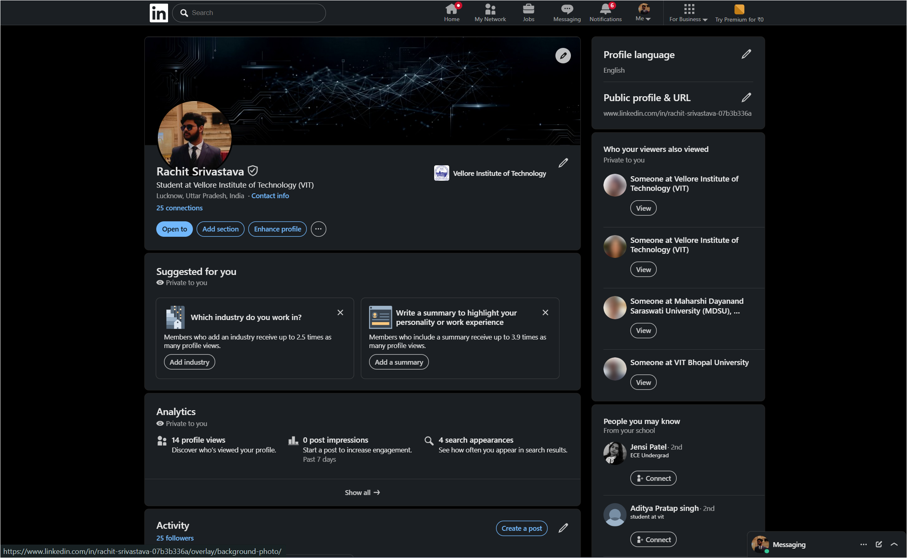
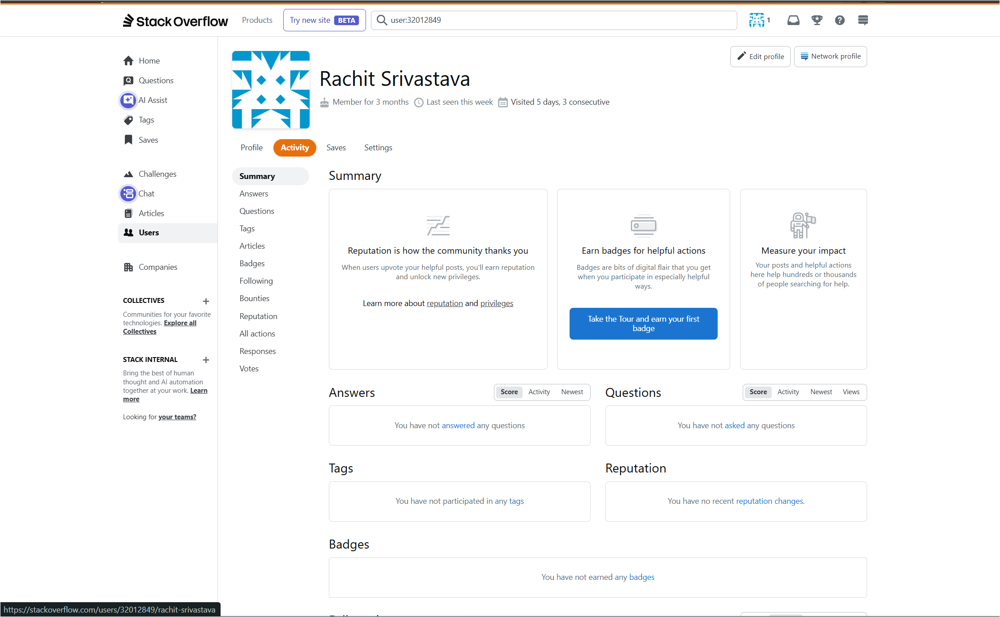
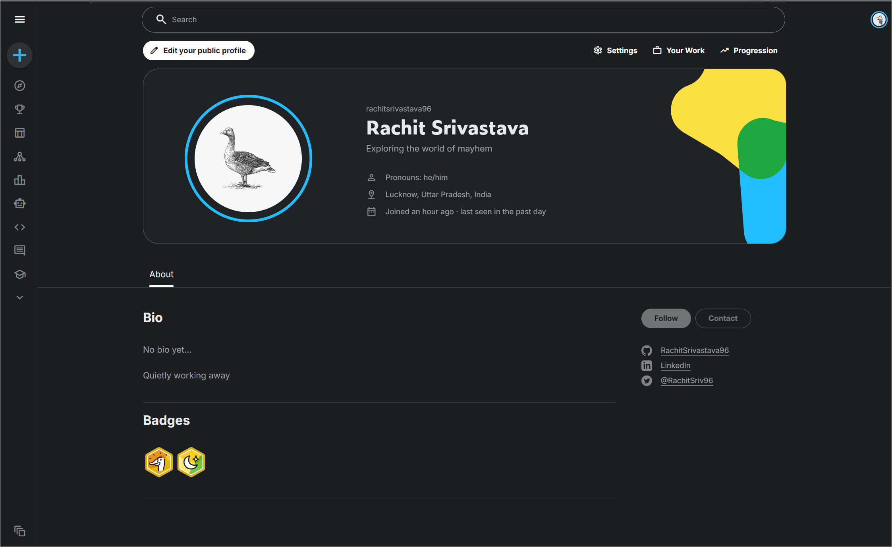

# Digital Literacy Portfolio
### CSE0001 – Digital Literacy | VIT Bhopal University

---

## Student Details

| Field | Details |
|---|---|
| Name | Rachit Srivastava |
| Registration No. | 25BCE11038 |
| Branch | B.Tech – Computer Science Engineering |
| Year | First Year (2025–26) |
| Course Code | CSE0001 |
| Platform | VITyarthi E-Learning Platform |

---

## Repository Structure

```
digital-literacy-project/
│
├── README.md
├── report/
│   └── Project_Report.pdf
│
├── task-1-presentation/
│   └── infographic.png
│
├── task-2-portfolio/
│   ├── Github.png
│   ├── Linkedin.png
│   ├── StackOverflow.png
│   └── Kaggle.png
│
├── task-3-platforms/
│   ├── hackerrank.png
│   ├── google-form.png
│   ├── google-form-responses.png
│   └── google-sheets.png
│
├── task-4-email-etiquette/
│   ├── emails.pdf
│   └── social-media-checklist.md
│
└── task-5-cybercrime/
    ├── casestudy.md
    └── prevention-checklist.md
```

---

## Tasks

### Task 1 — Digital Literacy Awareness Infographic

Created a one-page infographic using Canva covering safe internet practices,
professional online presence, and useful digital tools for students.

See `task-1-presentation/` for the design.

---

### Task 2 — Student Digital Portfolio

Set up professional profiles on GitHub, LinkedIn, Stack Overflow, and Kaggle.

| Platform | Profile |
|---|---|
| GitHub | [RachitSrivastava96](https://github.com/RachitSrivastava96) |
| LinkedIn | [Rachit Srivastava](https://www.linkedin.com/in/rachit-srivastava-07b3b336a) |
| Stack Overflow | [Rachit Srivastava](https://stackoverflow.com/users/32012849/rachit-srivastava) |
| Kaggle | [rachitsrivastava96](https://www.kaggle.com/rachitsrivastava96) |

#### Screenshots

| GitHub | LinkedIn |
|:---:|:---:|
|  |  |

| Stack Overflow | Kaggle |
|:---:|:---:|
|  |  |

---

### Task 3 — Coding and Collaboration Platforms

**Part A** — Completed the Solve Me First challenge on HackerRank.

**Part B** — Built a 5-question Digital Literacy Awareness Quiz on Google Forms.

| | |
|---|---|
| Google Form | [Digital Literacy Awareness Quiz](https://forms.gle/kJSRkyDkJtiWUz1VA) |

See `task-3-platforms/` for screenshots.

---

### Task 4 — Professional Email and Etiquette Guide

Drafted two professional emails — one requesting a deadline extension from a
professor, one expressing interest in a summer internship. Also created a
Social Media Do's and Don'ts checklist for college students.

See `task-4-email-etiquette/` for the drafts and checklist.

---

### Task 5 — Cybercrime Awareness Case Study

Wrote a case study on UPI phishing and digital payment fraud in India —
covering how attacks are structured, who gets targeted, and what the
consequences look like. Also created a Stay Safe Online checklist with
practical tips for college students, including two tips specific to UPI
and financial safety.

| Resource | |
|---|---|
| National Cyber Crime Portal | [cybercrime.gov.in](https://cybercrime.gov.in) |
| Helpline | 1930 (24x7) |

See `task-5-cybercrime/` for the case study and checklist.

---

## Project Report

Full written report covering all five tasks is in the `report/` folder.

---

## Author

Rachit Srivastava | 25BCE11038  
B.Tech CSE, VIT Bhopal University

---

*Submitted as part of CSE0001 – Digital Literacy | VIT Bhopal University*